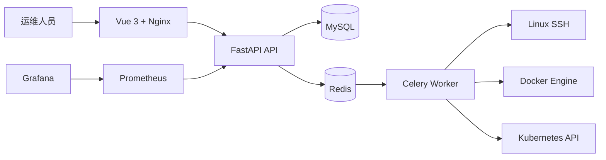

# EasyOps

[](https://github.com/guiyi-labs/devops-automation/actions/workflows/ci.yml)


> 面向 Linux 服务器与 Kubernetes 环境的自动化运维平台，覆盖资产、批量任务、容器、发布、告警与定时作业。

## 项目定位

EasyOps 将日常系统运维中的资产管理、批量操作、容器 / 集群查看、部署任务和监控告警组织到
同一个控制台。当前以 Docker Compose 单机部署为主要验证路径，同时保留 Kubernetes API 示例和
Linux 部署运维手册，适合作为系统运维、DevOps 和平台工程方向的实践项目。

## 已实现能力

| 方向 | 当前能力 | 主要实现位置 |
|---|---|---|
| 身份与资产 | 管理员初始化、登录、用户管理、服务器资产增删改查 | `api/v1/user.py`、`api/v1/asset.py` |
| 批量运维 | 批量命令入口、执行记录、Celery 异步任务 | `api/v1/exec_task.py`、`tasks/` |
| 容器与集群 | Docker 容器查询、Kubernetes Pod 查询 | `api/v1/docker_k8s.py`、`services/` |
| 发布管理 | 部署项目登记与发布执行入口 | `api/v1/deploy.py`、`services/deploy_service.py` |
| 监控告警 | 告警规则管理、Prometheus 指标暴露、Grafana / Prometheus 组合 | `api/v1/alert.py`、`docker-compose.yml` |
| 定时作业 | Cron 任务登记与查询，Celery Worker 承载异步执行 | `api/v1/cron_task.py`、`tasks/` |

## 架构概览



## 快速启动

准备 Docker Desktop 或 Docker Engine、Docker Compose v2，然后在项目根目录执行：

```bash
docker compose up -d --build
docker compose ps
```

访问地址：

| 服务 | 地址 | 用途 |
|---|---|---|
| Web 控制台 | `http://localhost:8080` | 登录并进入运维控制台 |
| API Swagger | `http://localhost:8000/docs` | 查看和调试接口 |
| Prometheus | `http://localhost:9090` | 查询指标 |
| Grafana | `http://localhost:3000` | 配置监控大盘 |

首次启动后，在登录页初始化本地演示管理员。仓库中的默认账号和数据库密码仅用于开发演示，
部署到真实环境前必须修改密码、`SECRET_KEY` 和数据库配置，并限制数据库、Redis、Swagger
和监控端口的访问范围。

## Linux 部署

Linux 部署、端口规划、组件连接、备份恢复与故障排查见：

- [Linux 部署与运维手册](docs/deployment.md)
- [组件连接关系](docs/component-connections.md)
- [卸载与恢复说明](docs/uninstall-restore.md)

最低建议配置：2 vCPU、4 GB RAM、20 GB 可用磁盘。小型长期运行环境建议 4 vCPU、8 GB RAM，
并将 MySQL、Redis、Grafana 数据卷放到独立磁盘或受控备份目录。

## Kubernetes 示例

`k8s/easyops-api.yaml` 提供 API 服务的 Kubernetes Deployment / Service 示例。它用于说明
容器化部署结构，不等同于完整的生产高可用清单；生产部署仍需补充 Secret、Ingress、持久化、
资源限制、探针、网络策略和滚动升级策略。

## CI 与本地验证

当前 GitHub Actions 包含两个基础门禁：后端 Python 语法检查和前端生产构建。

```bash
# 后端语法检查
python -m compileall -q easyops_api

# 前端构建
cd easyops_web
npm ci
npm run build
```

后续提升工程证据的优先事项是补充 API 单元测试、Compose 健康检查、真实 Linux 部署演练和
前端运行截图；在这些证据补齐前，README 不将项目描述为已经完成生产级验证。

## 运维边界

- SSH、Docker Engine 和 Kubernetes API 均需要用户明确配置凭据与网络访问权限。
- 批量命令和资产发现只能作用于获得授权的目标范围。
- 默认配置仅服务于本地演示，真实部署必须使用环境变量或外部 Secret 管理敏感信息。
- 真实服务器地址、kubeconfig、令牌和运行日志不得提交到仓库。

## 目录结构

```text
easyops_api/       FastAPI、数据模型、服务层与 Celery 任务
easyops_web/       Vue 3 控制台与 Nginx 配置
docker-compose.yml 单机部署与依赖组件
k8s/               Kubernetes 部署示例
docs/              Linux 部署、组件连接与交付文档
```
