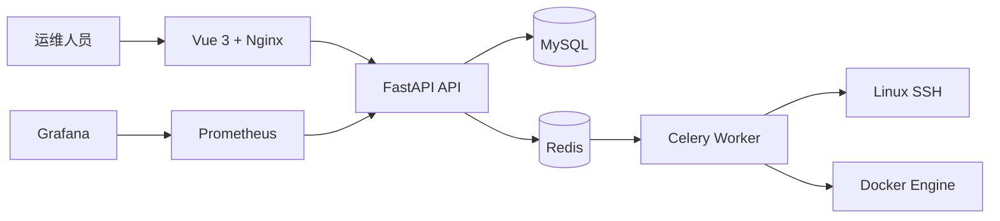

# EasyOps

[](https://github.com/guiyi-labs/devops-automation/actions/workflows/ci.yml)


> 面向 Linux 主机的自动化运维平台，覆盖资产、批量任务、容器、发布、告警与定时作业。

## 项目定位

EasyOps 将日常系统运维中的资产管理、批量操作、容器主机查看、部署任务和监控告警组织到
同一个控制台。当前以 Docker Compose 单机部署为主要验证路径，适合作为系统运维和 DevOps
方向的实践项目。Kubernetes 只作为 EasyOps 自身的可选部署环境，不作为本项目的管理对象。

## 已实现能力

| 方向 | 当前能力 | 主要实现位置 |
|---|---|---|
| 身份与资产 | 管理员一次性初始化、登录、三角色权限（admin/operator/viewer）、用户管理、服务器资产增删改查 | `api/v1/user.py`、`api/v1/asset.py`、`dependencies.py` |
| 安全基线 | 全路由鉴权、SSH 凭据加密存储、host key 指纹校验、日志脱敏、审计日志、生产配置校验 | `common/crypto.py`、`common/redact.py`、`services/ssh_service.py`、`config.py` |
| 测试与运行基线 | Alembic 数据库迁移、pytest 单元测试与覆盖率门禁、CI 依赖审计 / K8s 清单校验 / 链接检查 | `alembic/`、`tests/`、`.github/workflows/ci.yml` |
| 批量运维 | 受控批量链路：固定操作目录（磁盘/内存/服务/日志/端口）+ 参数白名单、preview 确认令牌、幂等键、有界并发与超时、逐主机结果与失败重试、break-glass 任意命令（默认关、仅 admin） | `api/v1/exec_task.py`、`services/operations.py`、`tasks/exec_tasks.py` |
| 容器主机 | Docker 容器查询与主机运行状态 | `api/v1/docker_k8s.py`、`services/docker_service.py` |
| 发布管理 | 部署项目登记与发布执行入口 | `api/v1/deploy.py`、`services/deploy_service.py` |
| 监控告警 | 告警规则管理、Prometheus 指标暴露、Grafana / Prometheus 组合 | `api/v1/alert.py`、`docker-compose.yml` |
| 定时作业 | Cron 任务登记与查询，Celery Worker 承载异步执行 | `api/v1/cron_task.py`、`tasks/` |

## 架构概览



## 快速启动

准备 Docker Desktop 或 Docker Engine、Docker Compose v2，然后：

```bash
# 1. 复制环境变量示例并按需修改（本地演示可直接使用默认值）
cp .env.example .env

# 2. 启动（MySQL/Redis 默认不映射宿主机端口；需要时叠加 ports 覆盖文件）
docker compose up -d --build
docker compose ps
# 需要宿主机直连 MySQL/Redis（或监控端口）时：
#   docker compose -f docker-compose.yml -f docker-compose.ports.yml up -d --build
```

访问地址：

| 服务 | 地址 | 用途 |
|---|---|---|
| Web 控制台 | `http://localhost:8080` | 登录并进入运维控制台 |
| API Swagger | `http://localhost:8000/docs` | 查看和调试接口 |
| Prometheus | `http://localhost:9090` | 查询指标 |
| Grafana | `http://localhost:3000` | 配置监控大盘 |

首次启动后在登录页点击「初始化管理员」（一次性 bootstrap，重复调用返回 409）。
仓库中的默认账号和数据库密码仅用于开发演示；部署到真实环境前必须设置
`APP_ENV=production`，并配置强随机 `SECRET_KEY`、`CREDENTIAL_ENCRYPTION_KEY`、
数据库密码和 `INITIAL_ADMIN_PASSWORD`——生产环境未配置或使用默认值时应用会拒绝启动。

## 安全能力与边界（E1）

已实现并经过测试（`easyops_api/tests/`）：

- **全路由鉴权**：所有业务接口未登录返回 401；`viewer` 写操作返回 403；
  用户管理仅 `admin`；`admin` / `operator` / `viewer` 三角色。
- **一次性 bootstrap**：`init-admin` 完成后自动关闭，重复调用返回 409。
- **SSH 凭据加密**：密码 / 私钥 Fernet 加密后落库（`v1:` 版本前缀），API 只返回
  `has_password` / `has_private_key`；Celery 任务只传资产 ID，Worker 内解密。
- **主机密钥校验**：默认拒绝未登记 host key 的主机，已登记指纹严格比对；
  认证失败 / 指纹不匹配 / 超时 / 不可达 / 命令失败返回可区分错误。
- **配置校验**：`APP_ENV=production` 时缺少关键 Secret 或使用默认值拒绝启动。
- **日志与审计**：日志、异常、审计对密码 / 私钥 / Token / 连接串统一脱敏；
  登录失败、权限拒绝、敏感操作写入 `audit_log`。
- **健康检查**：`/health/live`、`/health/ready`；Compose 全部服务带 healthcheck。

边界与已知限制：批量执行仅允许固定操作目录（任意命令需 break-glass，默认关闭、仅
admin）；`Swagger /docs` 默认开放；真实 Linux 演练、备份恢复与截图证据归 E4/E6，
README 不宣称生产级。

## Linux 部署

Linux 部署、端口规划、组件连接、备份恢复与故障排查见：

- [Linux 部署与运维手册](docs/deployment.md)
- [组件连接关系](docs/component-connections.md)
- [卸载与恢复说明](docs/uninstall-restore.md)

最低建议配置：2 vCPU、4 GB RAM、20 GB 可用磁盘。小型长期运行环境建议 4 vCPU、8 GB RAM，
并将 MySQL、Redis、Grafana 数据卷放到独立磁盘或受控备份目录。

## Kubernetes 部署示例

`k8s/easyops-api.yaml` 提供 API 服务的 Kubernetes Deployment / Service 示例。它用于说明
如何把 EasyOps 自身部署到 Kubernetes，不代表 EasyOps 负责管理 Kubernetes 集群或工作负载。
集群创建与 kubeadm / Ansible 交付见
[`kubernetes-cluster-bootstrap`](https://github.com/guiyi-labs/kubernetes-cluster-bootstrap)，
集群运行期的资源、诊断和事故响应见
[`aiops-platform`](https://github.com/guiyi-labs/aiops-platform)。该清单仍不等同于完整的生产
高可用清单；生产部署需补充 Secret、Ingress、持久化、资源限制、探针、网络策略和滚动升级策略。

## CI 与本地验证

GitHub Actions 包含：

- 后端：Ruff、语法检查、pytest（65 项）、全局覆盖率门禁（≥ 50%）、核心安全模块
  覆盖率门禁（`common` / `config` / `dependencies` / `services.ssh_service`，≥ 80%）、
  `pip-audit` 依赖审计、Alembic SQLite 迁移有效性校验。
- 前端：依赖安装、`npm audit --omit=dev`、生产构建。
- 部署：`docker compose config`（含 ports 覆盖）、kubeconform K8s 清单 schema 校验、
  `.env.example` 存在性与 README / docs 链接检查。

```bash
# 后端：语法检查 + 单元测试 + 覆盖率
cd easyops_api
python -m compileall -q .
pip install -r requirements-dev.txt
pytest -v                                    # 全量测试
pytest --cov=. --cov-report=term             # 全局覆盖率（≥ 50%）
pytest --cov=common --cov=config --cov=dependencies \
       --cov=services.ssh_service --cov-fail-under=80   # 安全模块覆盖率（≥ 80%）
pip-audit                                    # 依赖审计

# 数据库迁移（等价于容器启动时的 alembic upgrade head）
DATABASE_URL=sqlite:///dev.db alembic upgrade head

# 前端构建
cd ../easyops_web
npm ci
npm audit --omit=dev
npm run build
```

本地验证已通过（2026-08-14）：pytest 65 passed、Ruff 0 错误、全局覆盖率 88%、
安全模块覆盖率 91%、依赖审计 0 已知漏洞、前端 0 漏洞且构建通过。

后续提升工程证据的优先事项是真实 Linux 部署演练、备份恢复演练和前端运行截图；
在这些证据补齐前，README 不将项目描述为已经完成生产级验证。

## 运维边界

- SSH 和 Docker Engine 需要用户明确配置凭据与网络访问权限。
- 批量命令和资产发现只能作用于获得授权的目标范围。
- 默认配置仅服务于本地演示，真实部署必须使用环境变量或外部 Secret 管理敏感信息。
- 真实服务器地址、kubeconfig、令牌和运行日志不得提交到仓库。

## 与相关仓库的边界

| 仓库 | 负责什么 |
|---|---|
| [`kubernetes-cluster-bootstrap`](https://github.com/guiyi-labs/kubernetes-cluster-bootstrap) | Day 0/1 集群交付：预检、containerd、kubeadm、节点加入、CNI 和验收 |
| `devops-automation`（本仓库） | Linux 主机运行期：SSH、服务、进程、磁盘、批量任务、备份和主机监控 |
| [`aiops-platform`](https://github.com/guiyi-labs/aiops-platform) | Kubernetes 运行期：多集群、工作负载、可观测、诊断、事故响应和受控修复 |

本项目不提供 Pod、Deployment、CRD、多集群或 Kubernetes 事故管理功能；这些能力由
`aiops-platform` 统一承载。

## 目录结构

```text
easyops_api/       FastAPI、数据模型、服务层与 Celery 任务
easyops_web/       Vue 3 控制台与 Nginx 配置
docker-compose.yml 单机部署与依赖组件
k8s/               Kubernetes 部署示例
docs/              Linux 部署、组件连接与交付文档
```
